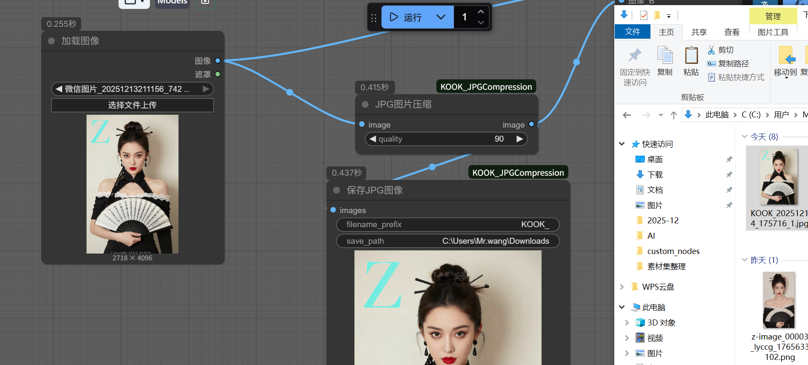
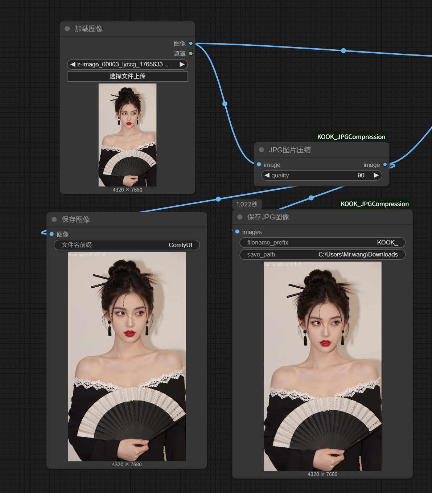

# KOOK JPG Compression 插件

这是一个用于ComfyUI的JPG压缩插件，提供高质量的JPEG图像压缩和保存功能。

## 功能特点

- **高质量JPEG压缩**：支持0-100质量调节，确保压缩后的图像质量可控
- **中英双语支持**：节点支持中英文搜索和显示
- 
- 
- 

## 节点说明

### JPG图片压缩
- **输入**：
  - `image`：输入图像
  - `quality`：压缩质量（0-100，默认90，如果图像较大例如10MB，可以设置为85左右，具体设置多少看你需要压缩成多大的文件大小，数值越低压缩越狠，质量就会有所下降，最低80左右就差不多，只会非常轻微的压缩图片质量，85往上图片压缩后，没有明显的质量下降，但是文件大小明显缩小。）
- **输出**：
  - `image`：压缩后的图像
  - 

### 保存JPG图像
- **输入**：
  - `images`：输入图像（支持批量处理）
  - `filename_prefix`：文件名前缀（默认："Comfyui_"，用户可自行填写）
  - `save_path`：保存路径（可选，留空则保存到默认output目录）
- **输出**：
  - 无直接输出，但会在节点上显示图像预览
- **功能**：
  - 支持自定义保存路径，若未填写则保存到ComfyUI的output目录
  - 自动生成唯一文件名，格式：`前缀+时间戳+索引.jpg`
  - 支持批量处理多张图像
  - 

## 安装方法

1. 下载或克隆此仓库
2. 将`KOOK_JPGCompression`文件夹复制到ComfyUI的`custom_nodes`目录下
3. 重启ComfyUI
4. 在节点菜单中找到"image"分类下的节点，或搜索"KOOK"、"JPG"

## 使用示例

1. 在ComfyUI中拖入一个"JPG图片压缩"节点
2. 连接输入图像到节点的`image`端口
3. 调节`quality`设置压缩质量
4. 将压缩后的图像连接到"保存JPG图像"节点
5. 执行工作流，查看预览并保存图像

## 技术实现

本插件使用Python的PIL库（Pillow）进行JPEG压缩，遵循ComfyUI的节点开发规范。压缩算法使用了以下优化：

- 启用`optimize=True`参数，优化JPEG编码
- 使用`subsampling=1`参数，保持较高的色度采样精度
- 支持RGB和RGBA图像格式自动转换

## 感谢

感谢GoogleChromeLabs开源该项目，为图像压缩技术提供了重要价值。

## 许可证

本插件采用MIT许可证，可自由使用和修改。

## 更新日志

- v1.0.0：初始版本，包含JPG压缩和保存功能
- 支持质量调节和实时预览
- 中英双语支持

## 作者

KOOK

## 联系方式

如有问题或建议，欢迎联系KOOK反馈。

# KOOK Image Compression 插件

这是一个用于ComfyUI的高质量图像压缩插件，提供高效的图像压缩和保存功能。

## 功能特点

- **高质量图像压缩**：支持0-100质量调节，确保压缩后的图像质量可控
- **中英双语支持**：节点支持中英文搜索和显示

## 节点说明
- 
- 
- 
### 高质量图片压缩
- **输入**：
  - `image`：输入图像
  - `quality`：压缩质量（0-100，默认90，如果图像较大例如10MB，可以设置为85左右，具体设置多少看你需要压缩成多大的文件大小，数值越低压缩越恨，质量就会有所下降，最低80左右就差不多，只会非常轻微的压缩图片质量，85往上图片压缩后，没有明显的质量下降，但是文件大小明显缩小。）
- **输出**：
  - `image`：压缩后的图像
  - 
### 保存JPG图像
- **输入**：
  - `images`：输入图像（支持批量处理）
  - `filename_prefix`：文件名前缀（默认："Comfyui_"，用户可自行填写）
  - `save_path`：保存路径（可选，留空则保存到默认output目录）
- **输出**：
  - 无直接输出，但会在节点上显示图像预览
- **功能**：
  - 支持自定义保存路径，若未填写则保存到ComfyUI的output目录
  - 自动生成唯一文件名，格式：`前缀+时间戳+索引.jpg`
  - 支持批量处理多张图像
  - 
 
## PNG图片压缩保存方法

本插件提供高质量的图像压缩，可以结合ComfyUI官方节点实现PNG图片的压缩保存：

1. 在ComfyUI中拖入一个"高质量图片压缩"节点
2. 连接输入图像到节点的`image`端口
3. 调节`quality`设置压缩质量（建议85-95，PNG保存时仍会保持高质量）
4. 将压缩后的图像连接到ComfyUI官方的"Save Image"节点
5. 在官方Save Image节点中选择PNG格式
6. 执行工作流，保存PNG格式的压缩图像

### PNG压缩特点
- **几乎无损**：PNG格式采用无损压缩算法，压缩后的图像质量几乎没有损失
- **适用于大图片**：对于较大的图片，PNG压缩可以显著减小文件大小，同时保持高质量
- **支持透明通道**：PNG格式支持RGBA透明通道，适合需要透明背景的图像
- **压缩效果明显**：结合本插件的高质量压缩预处理，再使用PNG格式保存，可以获得更小的文件大小
- 

## 安装方法

1. 下载或克隆此仓库
2. 将`KOOK_JPGCompression`文件夹复制到ComfyUI的`custom_nodes`目录下
3. 重启ComfyUI
4. 在节点菜单中找到"image"分类下的节点，或搜索"KOOK"、"JPG"

## 使用示例

1. 在ComfyUI中拖入一个"高质量图片压缩"节点
2. 连接输入图像到节点的`image`端口
3. 调节`quality`设置压缩质量
4. 将压缩后的图像连接到"保存JPG图像"节点
5. 执行工作流，查看预览并保存图像

## 技术实现

本插件使用Python的PIL库（Pillow）进行图像压缩，遵循ComfyUI的节点开发规范。压缩算法使用了以下优化：

- 启用`optimize=True`参数，优化图像编码
- 使用`subsampling=1`参数，保持较高的色度采样精度
- 支持RGB和RGBA图像格式自动转换
- 提供高质量的压缩效果，适用于各种图像格式

## 感谢

感谢GoogleChromeLabs开源该项目，为图像压缩技术提供了重要价值。

## 许可证

本插件采用MIT许可证，可自由使用和修改。

## 更新日志

- v1.0.0：初始版本，包含JPG压缩和保存功能
- 支持质量调节和实时预览
- 中英双语支持

## 作者

KOOK

## 联系方式

如有问题或建议，欢迎联系KOOK反馈。
